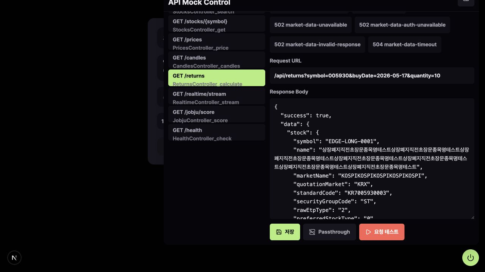
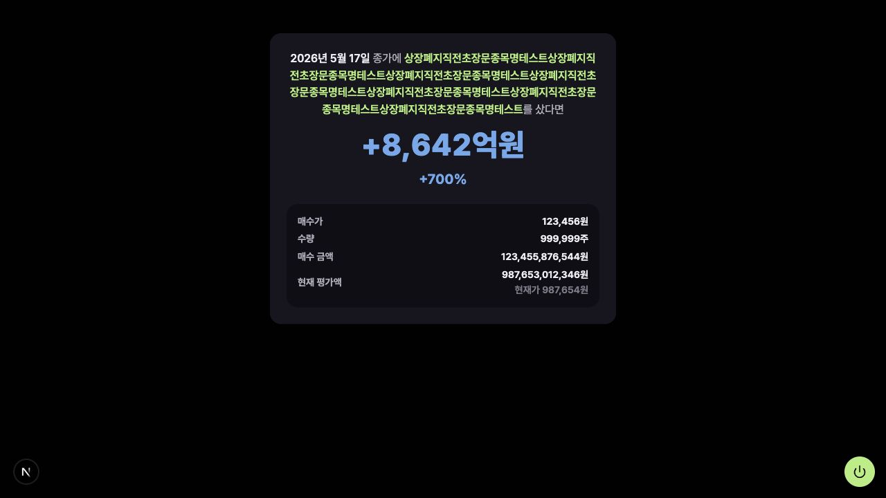

## 참고자료

[우아한형제들 테크 블로그 - msw GUI 도입기](https://techblog.woowahan.com/20154/)

MSW를 사용하면 서버에 요청을 보내지 않아도 프론트 개발을 진행할 수 있다.

프론트 입장에서는 실제 API를 호출하는 것처럼 코드를 작성하고, MSW가 중간에서 mock response를 내려준다. 서버 개발이 끝나지 않았거나, 특정 API가 아직 준비되지 않은 상황에서도 화면을 먼저 만들 수 있다.

성공 케이스만 확인할 수 있는 것도 아니다. 400, 404, 500 같은 status도 직접 설정할 수 있어서 에러 화면이나 예외 처리도 미리 확인할 수 있다.

## mock data 관리

처음에는 mock data를 직접 작성해도 크게 불편하지 않다.

```ts
return HttpResponse.json({
  code: "005930",
  name: "삼성전자",
  price: 72000,
})
```

하지만 endpoint가 늘어나면 이야기가 달라진다.

- 각 endpoint마다 200 응답을 만들어야 하고, 에러 케이스까지 확인하려면 400, 404, 500 같은 응답도 따로 준비해야 한다. 응답 구조가 바뀌면 mock data도 같이 바꿔야 한다.

현재 주식 도메인 프로젝트를 진행하는데, 종목코드는 타입으로 보면 string이지만, 실제로는 6자리 숫자 형식이어야 한다. 현재가, 수익률, 평가금액 같은 값도 현실적으로 고려해야 하고,
또한 특정 날짜의 수익률을 계산하는 기능이 있는데, 이를 모킹하기 위해서는 data가아니라 특정 핸들링 함수가 필요하거나, 또 휴장일을 고려해야 한다거나 하는 문제가 계속 발생했다.

현재 프로젝트에서는 `openapi.json`을 기반으로 API 코드를 자동 생성하고 있고, 백엔드에서는 zod schema를 사용하고 있고, schema의 `.meta()`에 예시 응답을 넣어두고 있어서, mock data도 이 흐름을 활용해서 만들었다.

```txt
zod schema
-> .meta() example
-> openapi.json
-> mock response template
-> MSW response
```

- 처음에는 Orval이라는 라이브러리를 활용해서 mock data(내부적으로 faker.js를 통해서 생성한다)를 생성하는 것도 고려해봤지만, 주식 도메인에서 바로 쓰기에는 값이 어색한 경우가 많았다. 종목명, 날짜, 가격, 수익률처럼 실제 데이터처럼 보여야 하는 값들이 프로젝트 맥락과 맞지 않았다.

## mock data를 클라이언트에서 조작해보자

기본 mock response template이 있어도, 이런 케이스를 보고 싶을 수 있다.

```txt
- 종목명이 매우 긴 경우
- 응답 배열이 비어 있는 경우
- 특정 필드가 null인 경우
- 수익률이 비정상적으로 큰 경우
```

이때마다 handler 코드를 직접 수정하는 방식은 번거롭고. 보통 AI에게 해결방법을 물어보면 이런 케이스들에 대해서 senario를 만들어라 라고 하지만, 사실 이것도 mock data v2를 만드는 것과 다를 바 없다고 생각한다.

그래서 직접 클라이언트에서, 데이터를 수정할 수 있는 GUI panel을 만들어봤다.

동작 방식은, 먼저 OpenAPI에 있는 operation 목록을 긁어와서, endpoint를 선택하고, status와 response body를 수정할 수 있게 구성했다.

```txt
endpoint 선택
-> status 선택
-> response body 수정
-> 저장
-> 다음 API 요청부터 변경된 mock response 반환
```



그래서 mock 응답을 코드 수정 없이 바꿀 수 있는 GUI를 만들었다.

GUI는 OpenAPI에서 가져온 API 목록을 보여준다.  
사용자는 endpoint를 선택하고, status를 선택하고, response body를 수정할 수 있다.

```txt
endpoint 선택
-> status 선택
-> response body 수정
-> 저장
```

저장을 누르면 선택한 응답이 mock override로 등록되고, 같은 API 요청이 들어오면 기본 mock response 대신 저장된 override 응답이 내려간다.

```
GUI
-> /api/mock/operations에서 endpoint와 response template 조회
-> 사용자가 operation/status/body 선택
-> /api/mock/overrides로 override 저장
-> backend mock runtime이 override를 메모리에 저장
-> 실제 API 요청 시 method + path가 맞으면 override 응답 반환
```

## AI browser agent와 같이 쓰기

사실 GUI의 데이터를 조작하는 것도 공수가 드는 작업이다. 특히 json을 사람이 편집하는 것도 어렵고, 이를 개선하고자 select같은 UI를 도입해본다던가도 해봤지만 코드 복잡도가 느는것에 비해 큰 이득은 없었던 것 같다.

그래서 보통 이 데이터 편집을 AI한테 맡기고 있었는데, 문득 이 GUI와 AI를 활용해서 아예 QA를 진행하도록 할 수 있지 않을까?라는 생각이 들었다.

```txt
먼저 해당 페이지의 API 요청 관련 코드를 분석한 뒤 어떻게 테스트할지 시나리오를 작성한다
-> AI(agent-browser를 활용)가 mock GUI를 연다
-> 특정 endpoint를 선택한다
-> 시나리오 대로 응답 값 + 뷰포트, 다크모드 등을 수정한다.
-> 스크린샷을 찍는다
-> 스크린샷을 같이 파악하면서 고쳐야 할 점이 있는지 파악한다.
```


