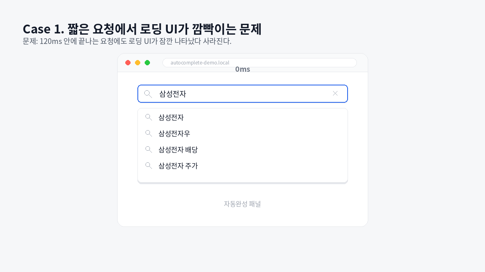
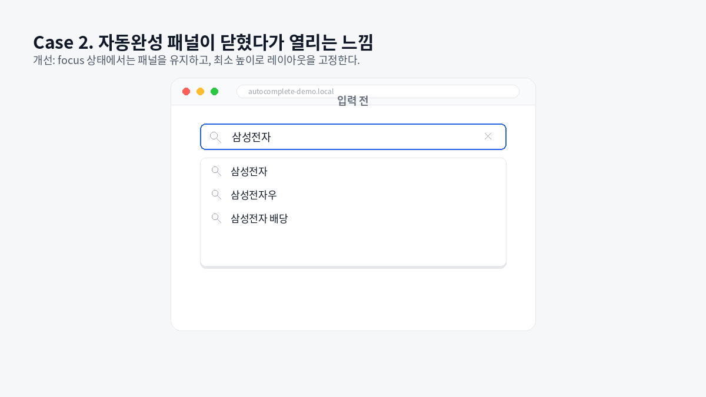
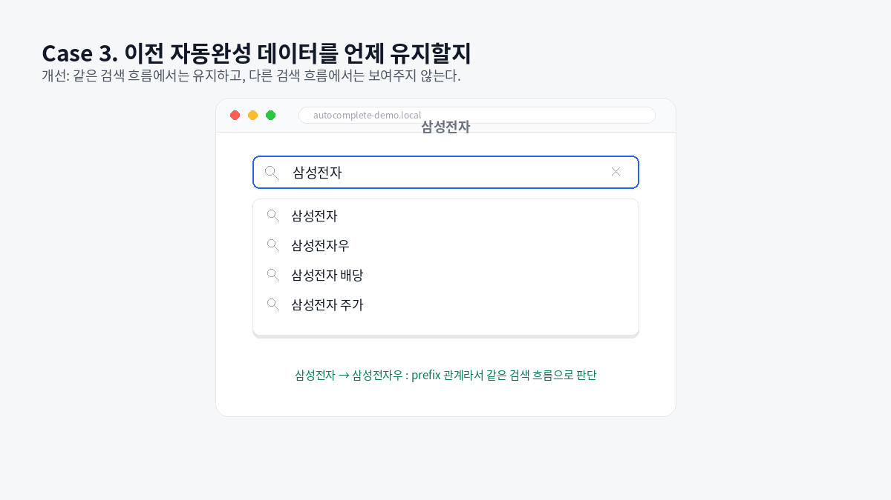

자동완성은 검색어를 입력하면 API 요청을 보내고, 응답 데이터로 자동완성 패널을 렌더링하는 방식으로 동작한다.

```text
검색어 입력
-> 자동완성 API 요청
-> 응답 데이터로 자동완성 목록 렌더링
```

TanStack Query의 `useQuery`를 활용하면 서버 데이터를 불러오는 것 뿐만 아니라 요청 상태, 캐시를 쉽게 다룰 수 있다.

하지만 자동완성처럼 입력에 따라 요청이 자주 발생하는 UI에서는 단순히 요청 상태를 그대로 화면에 연결했을 때 어색한 부분이 생길 수 있다.

검색어가 바뀔 때마다 요청이 발생하고, 요청이 시작되면 로딩 UI를 보여주고, 요청이 끝나면 다시 자동완성 목록을 보여주는 구조라고 생각해보면 된다.

```text
자동완성 목록
-> 로딩 UI
-> 자동완성 목록
```

요청 시간이 길다면 이 흐름이 자연스럽게 느껴질 수 있다.

하지만 요청이 아주 짧게 끝나는 경우에는 로딩 UI가 잠깐 나타났다가 사라지고, 자동완성 패널도 순간적으로 비었다가 다시 채워지는 것처럼 보인다.

이 과정이 사용자에게는 로딩이라기보다 화면이 깜빡이는 것처럼 느껴질 수 있다.

그래서 자동완성 패널에서 발생하는 UI 문제를 하나씩 나눠서 개선해보았다.

## 1. 짧은 로딩 UI로 인한 깜빡임

처음에는 `useQuery`의 `isFetching` 상태를 기준으로 로딩 UI를 보여주고 있었다.

```tsx
if (isFetching) {
  return <Loading />
}
```

이 방식은 요청이 진행 중이라는 상태를 표현하기에는 단순하고 명확하다.

하지만 자동완성 UI에서는 조금 다르게 느껴졌다.

검색어를 입력할 때마다 자동완성 API 요청이 발생하고, 요청이 시작되는 순간 `isFetching`이 `true`가 된다. 그리고 요청이 빠르게 끝나면 `isFetching`은 다시 `false`가 된다.

이때 로딩 UI가 아주 짧은 시간 동안만 화면에 나타난다.

```text
검색어 입력
-> isFetching true
-> 로딩 UI 표시
-> 요청 완료
-> 자동완성 목록 표시
```



요청 시간이 짧으면 사용자는 로딩 UI를 인지하기보다 자동완성 패널이 순간적으로 깜빡였다고 느낄 수 있다.

특히 자동완성 패널은 input 바로 아래에 붙어 있고, 사용자가 입력하는 동안 계속 시선이 머무는 영역이기 때문에 이런 전환이 더 크게 느껴진다.

그래서 200ms를 기준으로, 그 전에 응답이 오면 로딩 UI를 보여주지 않고, 이후의 요청에만 로딩 UI를 보여주는 방식으로 해결했다.

```tsx
function AutocompletePanel() {
  if (isFetching) {
    return (
      <Delay ms={200}>
        {" "}
        //200ms동안은 Loading 컴포넌트가 렌더링되지 않음
        <Loading />
      </Delay>
    )
  }

  return <AutocompleteList items={data ?? []} />
}
```

## 2. 자동완성 패널이 닫혔다가 열리는 느낌

로딩 UI의 깜빡임을 줄였더라도, 또 다른 문제가 있었다.

예를 들어 `삼성전자`를 검색한 뒤, 뒤에 `우`를 붙여서 `삼성전자우`를 검색하는 케이스를 생각해볼 수 있다.

```text
삼성전자 자동완성 목록
-> 새 요청 진행 중
-> 삼성전자우 자동완성 목록
```

1번에서 로딩 UI의 노출을 지연시켰기 때문에, 요청이 진행되는 짧은 시간 동안에는 로딩 UI도 보이지 않고 새 자동완성 목록도 아직 없다.

이때 자동완성 패널 자체가 사라지거나 높이가 줄어들면 사용자는 자동완성 패널이 닫혔다가 다시 열리는 것처럼 느낄 수 있다.

```text
삼성전자 자동완성 목록
-> 자동완성 패널이 비어 보임
-> 삼성전자우 자동완성 목록
```

자동완성 목록이 바뀌는 것은 자연스럽지만, 자동완성 패널의 영역 자체가 계속 열리고 닫히는 것은 어색했다.

이 문제는 자동완성 패널의 레이아웃을 유지하는 방식으로 완화할 수 있다.

input에 focus가 있고 검색어가 존재하는 동안에는 자동완성 패널을 유지하고, 자동완성 패널에는 적당한 최소 높이를 설정했다.

```tsx
function AutocompletePanel({ isOpen, children }: AutocompletePanelProps) {
  if (!isOpen) {
    return null
  }

  return <div className="autocomplete-panel">{children}</div>
}
```

```css
.autocomplete-panel {
  min-height: 240px;
}
```



이렇게 하면 새 요청이 진행되는 동안 자동완성 목록이 잠깐 비어 있더라도, 자동완성 패널의 영역은 유지된다.

사용자 입장에서는 패널이 닫혔다가 다시 열리는 것이 아니라, 같은 패널 안에서 내용만 바뀌는 흐름으로 느낄 수 있다.

정리하면 이 문제는 데이터 요청의 문제가 아니라 레이아웃 안정성의 문제였다.

자동완성 패널은 검색어 입력 중 계속 유지되는 UI 영역이고, 자동완성 목록만 요청 상태에 따라 바뀌도록 분리하는 것이 더 자연스러웠다.

## 3. 이전 자동완성 데이터 유지

자동완성 패널의 영역을 유지한 뒤에는, 새 요청이 진행되는 동안 무엇을 보여줄지에 대한 문제가 남았다.

검색어가 queryKey에 포함되어 있다면, `삼성전자`에서 `삼성전자우`로 입력이 바뀌는 순간 TanStack Query는 새로운 queryKey를 바라보게 된다.

```tsx
useQuery({
  queryKey: ["autocomplete", "stock", debouncedQuery],
  queryFn: () => fetchAutocomplete(debouncedQuery),
})
```

새 queryKey에 해당하는 캐시 데이터가 없다면, 요청이 끝나기 전까지는 보여줄 자동완성 데이터가 없다.

이때 자동완성 패널은 유지되지만, 내부 자동완성 목록은 비어 보일 수 있다.

```text
삼성전자 자동완성 목록
-> 빈 자동완성 패널
-> 삼성전자우 자동완성 목록
```

하지만 `삼성전자`에서 `삼성전자우`로 이어지는 흐름에서는 기존 자동완성 데이터를 잠깐 유지하는 편이 더 자연스럽다.

사용자는 완전히 다른 검색을 시작한 것이 아니라, 기존 검색어를 더 구체화하고 있기 때문이다.

TanStack Query v5에서는 이런 경우 `placeholderData`를 활용할 수 있다.

`placeholderData`에서 이전 query의 데이터를 반환하면, 새 queryKey의 요청이 진행되는 동안 이전 자동완성 데이터를 임시로 보여줄 수 있다.

```tsx
useQuery({
  queryKey: ["autocomplete", "stock", debouncedQuery],
  queryFn: () => fetchAutocomplete(debouncedQuery),
  placeholderData: (previousData) => previousData,
})
```

이렇게 하면 새 요청이 끝나기 전까지 이전 자동완성 데이터가 유지되고, 요청이 완료되면 새 자동완성 데이터로 교체된다.



하지만 모든 경우에 이전 자동완성 데이터를 유지하는 것은 어색할 수 있다.

예를 들어 `삼성전자`를 입력한 뒤 검색어를 지우고 `하이브`를 입력하는 케이스를 생각해볼 수 있다.

```text
삼성전자
-> 검색어 삭제
-> 하이브
```

이 경우에는 `삼성전자`와 `하이브`가 같은 검색 흐름이라고 보기 어렵다.

그런데 이전 자동완성 데이터를 무조건 유지하면, `하이브`를 입력하는 중에도 잠깐 `삼성전자`의 자동완성 목록이 노출될 수 있다.

이건 오히려 더 어색하다.

그래서 이전 검색어와 현재 검색어가 같은 흐름인지 판단한 뒤, 그 경우에만 이전 자동완성 데이터를 유지하도록 처리했다.

```tsx
useQuery({
  queryKey: ["autocomplete", "stock", debouncedQuery],
  queryFn: () => fetchAutocomplete(debouncedQuery),
  placeholderData: (previousData, previousQuery) => {
    const previousQueryKey = previousQuery?.queryKey
    const previousQueryText = previousQueryKey?.[2]

    if (
      typeof previousQueryText !== "string" ||
      debouncedQuery.trim().length === 0
    ) {
      return undefined
    }

    const isSameSearchFlow =
      debouncedQuery.startsWith(previousQueryText) ||
      previousQueryText.startsWith(debouncedQuery)

    return isSameSearchFlow ? previousData : undefined
  },
})
```

여기서 `startsWith`를 사용한 이유는 이전 검색어와 현재 검색어가 prefix 관계인지 확인하기 위해서다.

```text
삼성전자 -> 삼성전자우
삼성전자우 -> 삼성전자
```

이런 케이스는 같은 검색 흐름으로 볼 수 있다.

반대로 아래와 같은 케이스는 같은 검색 흐름으로 보기 어렵다.

```text
삼성전자 -> 하이브
삼성전자 -> 카카오
```

그래서 같은 검색 흐름이라고 판단되는 경우에는 이전 자동완성 데이터를 유지하고, 그렇지 않은 경우에는 새 요청이 끝날 때까지 이전 자동완성 데이터를 보여주지 않도록 했다.

이 방식은 query cache를 직접 지우는 방식이 아니다.

`placeholderData`는 새 queryKey의 실제 cache를 채우는 값이 아니라, 요청이 진행되는 동안 현재 observer에서 임시로 보여줄 데이터를 결정하는 역할에 가깝다.

그래서 캐시를 건드리지 않고도, 자동완성 패널에서 이전 자동완성 데이터를 언제 유지할지 제어할 수 있었다.

## 4. 정리

자동완성 UI를 만들 때 처음에는 API 요청과 응답 데이터만 생각하기 쉽다.

```text
검색어 입력
-> API 요청
-> 자동완성 목록 렌더링
```

하지만 실제로는 요청 상태가 UI에 어떻게 반영되는지가 더 중요했다.

특히 요청과 응답이 짧은 시간 안에 끝나는 경우에는 로딩 UI를 보여주는 것 자체가 사용자에게 도움이 되지 않을 수 있다.

이번에는 자동완성 패널에서 발생하는 문제를 세 가지로 나눠서 봤다.

- 짧은 요청에서 로딩 UI가 깜빡이는 문제
- 자동완성 패널이 닫혔다가 열리는 것처럼 보이는 문제
- 새 요청 중 이전 자동완성 데이터를 언제 유지할지에 대한 문제

각각의 해결 방식은 다음과 같았다.

- 로딩 UI는 바로 보여주지 않고 일정 시간 이후에만 보여준다.
- input에 focus가 있고 검색어가 존재한다면 자동완성 패널의 영역을 유지한다.
- 같은 검색 흐름에서는 이전 자동완성 데이터를 유지하고, 다른 검색 흐름에서는 유지하지 않는다.

TanStack Query는 서버 상태를 쉽게 다룰 수 있게 해주지만, 그 상태를 그대로 UI에 연결한다고 해서 항상 자연스러운 UX가 만들어지는 것은 아니었다.

자동완성처럼 입력과 요청이 자주 발생하는 UI에서는 `isFetching`, `placeholderData`, 패널 open 상태, 최소 높이 같은 요소를 함께 고려해야 했다.

결국 중요한 것은 요청이 얼마나 빨리 끝나는지가 아니라, 그 짧은 상태 변화가 사용자에게 어떻게 보이는지였다.

- 이 밖에도 react의 useDefferedValue 등을 활용하는 방법도 존재한다.
