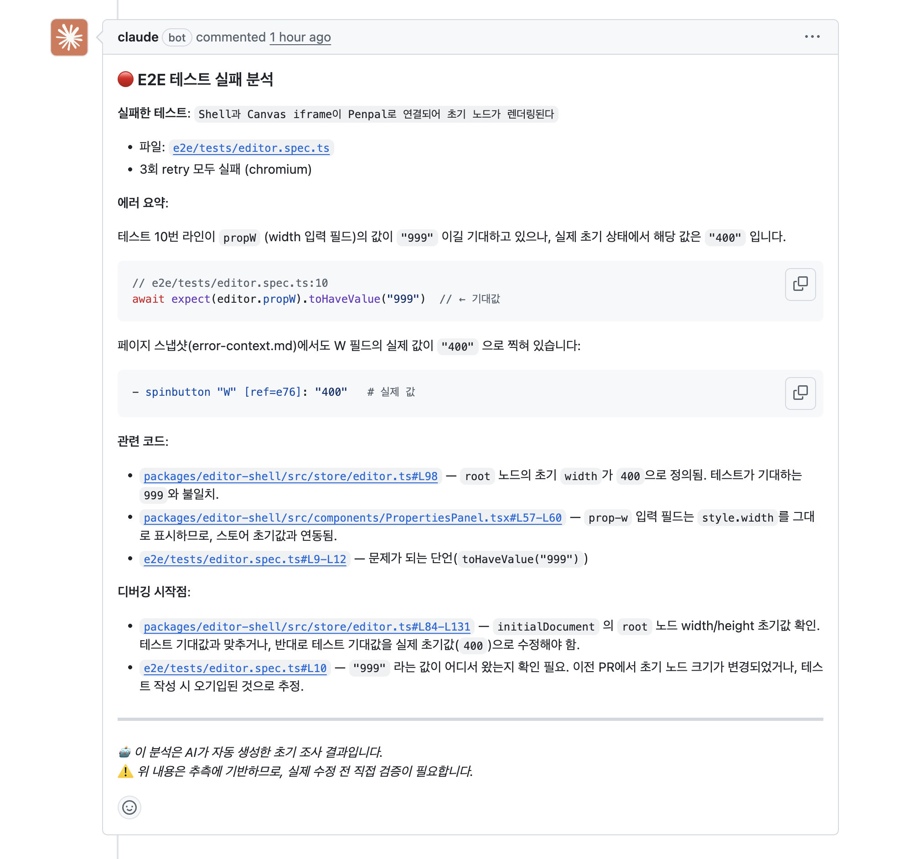
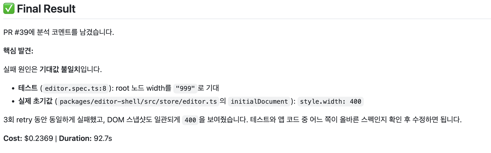

## Claude Code Action 이란

**Claude Code Action**은 Anthropic에서 공식적으로 출시한 도구로, Claude Code를 GitHub Actions 환경에서 그대로 사용할 수 있게 해준다(Claude Code SDK를 활용하는 방식이다)

옵션을 통해 prompt, plugin ,skill 등 claude code에서 사용하는 기능들을 붙일 수 있다.

- Claude Code Action이 가장 좋은 점은, **Subscription** 계정 연동을 통해서도 사용할 수 있다는 점이다(codex는 api key 방식밖에 안된다)

이러한 구조를 활용하여 Playwright E2E 테스트가 실패했을 때 AI가 자동으로 원인을 분석하고 리포팅하는 워크플로우를 구축해 보았다.

## 1. Playwright 에러 컨텍스트 활용

Playwright **v1.52 이상** 버전부터는 테스트 실패 시 `test-results` 폴더 내부에 `error-context.md` 파일이 생성된다.
이 파일은 실패 시점의 DOM 구조를 텍스트 스냅샷 형태로 기록하고 있어, AI가 상황을 분석하기에 최적화된 데이터를 제공한다.

### error-context.md 예시

````md
Page snapshot

```yaml
- generic [active] [ref=e1]:
    - generic [ref=e3]:
        - button "↶" [disabled] [ref=e8] [cursor=pointer]
        - button "T" [ref=e13] [cursor=pointer]
      # ... 테스트 당시의 UI 구조가 담김
```
````

- playwright ui mode에서는 'copy prompt' 라는 버튼을 누르면 이러한 스냅샷과 프롬프트를 제공한다

## 2. GitHub Actions 워크플로우 구성

테스트 실패 시 에러 로그를 파일로 저장하고,
이후 `anthropics/claude-code-action@v1`을 실행하여 로그와 `error-context.md`, 그리고 소스 코드를 교차 검증하도록 명령하는 프롬프트를 제공하면 끝이다.

```yaml
name: E2E Tests

on:
 pull_request:
  types: [opened, synchronize]

jobs:
 e2e:
  runs-on: ubuntu-latest
  permissions:
   contents: read
   pull-requests: write
   issues: write
   id-token: write
  steps:
   ...setup 과정
   - name: Run E2E tests
     id: e2e
     shell: bash
     run: set -o pipefail; pnpm test:e2e 2>&1 | tee e2e-output.log
     continue-on-error: true

   - name: Analyze E2E failure with Claude
     if: steps.e2e.outcome == 'failure'
     uses: anthropics/claude-code-action@v1
     with:
      claude_code_oauth_token: ${{ secrets.CLAUDE_CODE_OAUTH_TOKEN }}
      prompt: |
       REPO: ${{ github.repository }}
       PR NUMBER: ${{ github.event.pull_request.number }}

       ## 역할
       당신은 작업자가 테스트 실패의 원인을 빠르게 파악할 수 있도록 컨텍스트를 정리하는 조사관입니다.

       ## 분석 절차
       1. `e2e-output.log`에서 테스트 실패 로그를 읽으세요
       2. `test-results/` 폴더에서 `error-context.md` 파일들을 모두 찾아 읽으세요
       3. 실패한 테스트의 소스코드(`e2e/tests/*.spec.ts`)와 POM(`e2e/pom/`)을 확인하세요
       4. 관련 애플리케이션 코드 영역을 탐색하세요

       ## 원칙
       - 수정 제안이나 코드 픽스를 하지 마세요.
       - 작업자가 디버깅을 시작할 수 있는 진입점(파일, 함수, 라인)을 명확히 안내하세요.
       - 파일 경로는 GitHub 링크 형태로 제공하세요.

       분석 결과를 `gh pr comment`로 PR에 코멘트로 남겨주세요.

       ## 응답 형식
       ### 🔴 E2E 테스트 실패 분석

       **실패한 테스트**: [테스트 이름과 파일 경로]

       **에러 요약**: [무엇이 실패했는지]

       **관련 코드**:
       - [파일명](https://github.com/${{ github.repository }}/blob/${{ github.sha }}/파일경로#L라인번호) - 관련성 설명

       **디버깅 시작점**:
       - [파일명](https://github.com/${{ github.repository }}/blob/${{ github.sha }}/파일경로#L라인번호) - 확인 방법

       ---
       *🤖 이 분석은 AI가 자동 생성한 초기 조사 결과입니다.*
       *⚠️ 위 내용은 추측에 기반하므로, 실제 수정 전 직접 검증이 필요합니다.*
      claude_args: |
       --allowedTools "Read,Glob,Grep,Bash(gh pr comment:*)"

   - name: Fail if E2E tests failed
     if: steps.e2e.outcome == 'failure'
     run: exit 1
```

---

## 3. 후기 및 최적화 팁



- 나는 현재 제공한 context 뿐만 아니라 관련 코드 영역을 탐색하라고 명시했고, tool 권한 또한 폭넓게 제공했기에 실제 소스코드까지 확인해서 더 좋은 output을 내는 걸 볼 수 있다.

- 하지만 탐색한 만큼 토큰(or api 비용)이 나가는 시스템이기 때문에, 만약 context에 대한 분석만 필요하다면, 프롬프트와 tool 권한을 조정해서 활용하는 것도 좋을 것 같다.



- ~~이거 하나 찾는데 0.2달러~~
